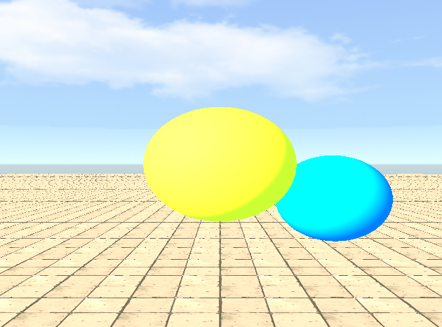

<p align="center">

</p>

# PyRaymarching
This is me tinkering with Raymarching for fun. This is just a playground and i am not planning to maintain it. Have fun!  
  
## Running
First run `install.sh` on Linux or `install.ps1` on Windows. This will create python environment and install all dependencies into it.  
After that you will hopefully be able to just run it with `run.sh` or `run.ps1`.
  
There is also a manual way that should work:  
```
python3 -m venv venv
source venv/bin/activate
pip install -r requirements.txt
python run.py
```
